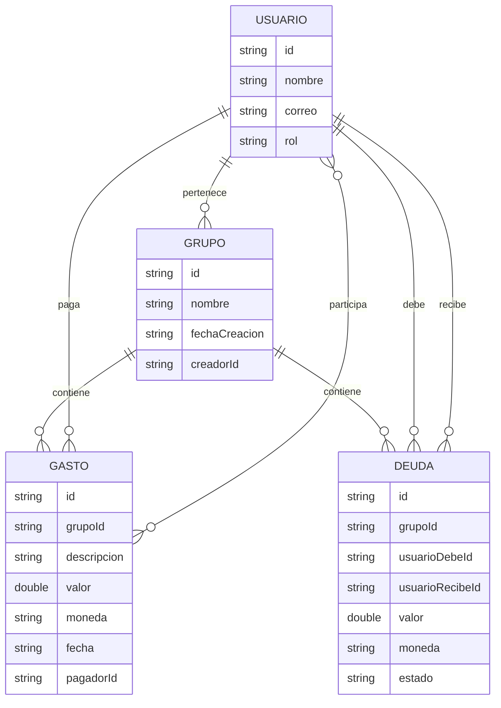
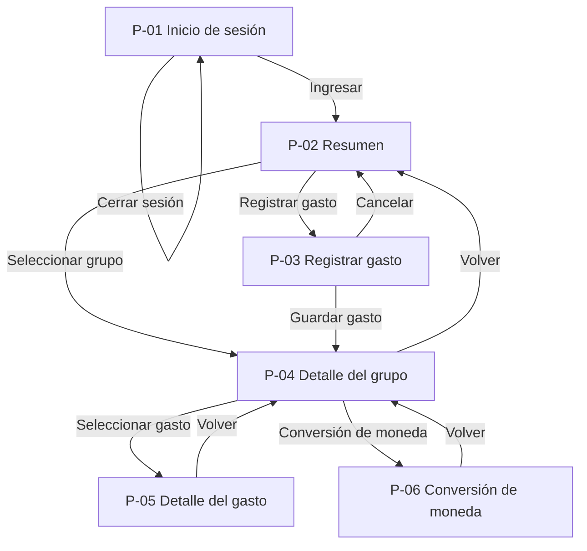

# Split Pay

|               |                                                                                                            |
| ------------- | ---------------------------------------------------------------------------------------------------------- |
| Integrantes   | Daniela Estrada Mesa, [Nombre del integrante 2], [Nombre del integrante 3]                                 |
| Curso y grupo | Programación Móvil IF2004, grupo 602                                                                       |
| Fecha         | Septiembre de 2026                                                                                         |
| Versión       | 1.0                                                                                                        |

## Tabla de contenido

1. [Descripción general](#1-descripción-general)
2. [Problema](#2-problema)
3. [Objetivos](#3-objetivos)
4. [Stakeholders, actores y roles](#4-stakeholders-actores-y-roles)
5. [Alcance](#5-alcance)
6. [Funcionalidades](#6-funcionalidades)
7. [Requerimientos funcionales](#7-requerimientos-funcionales)
8. [Requerimientos no funcionales](#8-requerimientos-no-funcionales)
9. [Reglas de negocio](#9-reglas-de-negocio)
10. [Modelo de datos](#10-modelo-de-datos)
11. [Pantallas y mapa de navegación](#11-pantallas-y-mapa-de-navegación)
12. [Mockup](#12-mockup)
13. [Historias de usuario, casos de uso, restricciones y supuestos](#13-historias-de-usuario-casos-de-uso-restricciones-y-supuestos)
14. [Arquitectura técnica y navegación implementada](#14-arquitectura-técnica-y-navegación-implementada)
15. [Historial de cambios](#historial-de-cambios)
16. [Referencias](#referencias)
17. [Declaración de uso de inteligencia artificial](#declaración-de-uso-de-inteligencia-artificial)

## 1. Descripción general

Split Pay es una aplicación móvil para registrar, organizar y consultar gastos compartidos entre varias personas. Está dirigida a usuarios que comparten gastos en grupos y necesitan conocer de forma clara cuánto ha pagado cada integrante, cuánto le corresponde asumir, cuánto debe pagar y cuánto debe recibir.

La aplicación permite crear y consultar grupos, registrar gastos indicando su descripción, valor, moneda, fecha, persona que realizó el pago y participantes, consultar el historial de gastos y visualizar los balances y las deudas existentes entre los integrantes.

La aplicación también permite consultar tasas de cambio mediante una API externa para facilitar la conversión de valores entre diferentes monedas.

El usuario debe iniciar sesión para acceder a la aplicación. Después de ingresar puede consultar sus grupos, registrar gastos y seleccionar un grupo para consultar su historial, aportes, balances y deudas.

Split Pay será desarrollada como una aplicación móvil utilizando Flutter y Dart. La información de usuarios, grupos, integrantes y gastos se almacenará mediante Firebase Firestore y la autenticación se realizará mediante Firebase Authentication. La información de tasas de cambio será obtenida mediante la API externa Frankfurter.

## 2. Problema

Las aplicaciones bancarias permiten consultar transacciones individuales, pero no están diseñadas para realizar un seguimiento detallado de gastos compartidos entre varias personas. Cuando varias personas realizan pagos para un grupo, puede resultar difícil identificar quién realizó cada pago, cuánto ha aportado cada integrante, cuánto le corresponde asumir a cada persona y cuáles deudas continúan pendientes.

Esta situación puede presentarse en viajes, viviendas compartidas, cenas, actividades grupales o cualquier situación en la que varias personas compartan gastos. Cuando los gastos se acumulan con el tiempo, llevar el control mediante conversaciones, notas o cálculos manuales puede generar confusión y dificultar la consulta del historial.

Split Pay busca solucionar esta situación mediante una aplicación móvil que centraliza los gastos compartidos de cada grupo y permite consultar la información desde un teléfono. La aplicación móvil resulta apropiada porque los usuarios pueden registrar un gasto inmediatamente después de realizar un pago y consultar sus balances y obligaciones desde cualquier lugar.

## 3. Objetivos

### 3.1 Objetivo general

Desarrollar un MVP móvil que permita registrar y consultar gastos compartidos, mantener un historial financiero organizado de los grupos y calcular los aportes, balances y obligaciones de cada integrante.

### 3.2 Objetivos específicos

* Permitir que un usuario registre un gasto compartido indicando descripción, valor, moneda, fecha, pagador y participantes.

* Mantener un historial organizado de los gastos registrados dentro de cada grupo.

* Calcular la participación correspondiente a cada integrante de acuerdo con los participantes seleccionados.

* Mostrar cuánto ha aportado cada integrante dentro de un grupo.

* Identificar los valores pendientes de pago y los valores que cada integrante debe recibir.

* Permitir consultar el detalle de cada gasto registrado.

* Permitir consultar información de gastos anteriores por grupo.

* Obtener tasas de cambio mediante una API externa para realizar conversiones entre monedas.

* Mantener la información almacenada en Firebase Firestore para que pueda consultarse posteriormente.

* Mantener el código fuente, las tareas y los cambios del proyecto organizados mediante GitHub.

## 4. Stakeholders, actores y roles

### 4.1 Stakeholders

* Usuarios finales: utilizan la aplicación para registrar y consultar gastos compartidos, grupos, aportes, balances y deudas.

* Equipo de desarrollo: responsable de analizar, diseñar, desarrollar, probar y documentar la aplicación.

* Docente: responsable de orientar y evaluar el proyecto durante el semestre.

* GitHub: plataforma utilizada para almacenar el código fuente, gestionar Issues, ramas, Pull Requests y documentación.

* Firebase: conjunto de servicios utilizados para la autenticación y almacenamiento de información.

* Proveedor de API: servicio externo utilizado para obtener información de tasas de cambio.

### 4.2 Actores

* Usuario: puede iniciar sesión, consultar sus grupos, registrar gastos, consultar historiales, consultar aportes, consultar balances, consultar deudas y consultar conversiones de moneda.

* Firebase Authentication: gestiona la autenticación de los usuarios.

* Firebase Firestore: almacena usuarios, grupos, integrantes, gastos y registros relacionados.

* API de tasas de cambio: proporciona información para realizar conversiones entre monedas.

* GitHub: permite gestionar el código, las tareas, las ramas, los Pull Requests y la documentación del proyecto.

### 4.3 Roles

El MVP utilizará un único rol funcional denominado Usuario. Todos los usuarios autenticados tendrán las mismas funcionalidades dentro de los grupos a los que pertenecen.

El usuario podrá consultar únicamente la información de los grupos de los que sea integrante.

No se implementarán roles administrativos, roles empresariales ni permisos especiales adicionales en esta versión.

### 4.4 Inicio de sesión

El usuario deberá registrarse o iniciar sesión mediante correo electrónico y contraseña. Firebase Authentication será responsable de validar las credenciales y mantener la sesión del usuario.

Un usuario sin sesión iniciada no podrá acceder a los grupos ni a los gastos almacenados.

## 5. Alcance

### 5.1 Incluye

* Registro de usuarios.

* Inicio de sesión.

* Consulta de grupos.

* Creación de grupos.

* Consulta de integrantes de un grupo.

* Registro de gastos compartidos.

* Identificación de la persona que realizó cada pago.

* Selección de los participantes de cada gasto.

* Registro de descripción, valor, moneda y fecha.

* Cálculo de la participación correspondiente a cada integrante.

* Historial de gastos.

* Consulta del detalle de un gasto.

* Consulta de aportes realizados por los integrantes.

* Consulta de balances individuales.

* Identificación de saldos pendientes.

* Consulta de deudas.

* Marcación de una deuda como pagada.

* Conversión entre monedas mediante una API externa.

* Almacenamiento de información mediante Firebase Firestore.

* Autenticación mediante Firebase Authentication.

* Gestión del código, Issues, ramas y Pull Requests mediante GitHub.

### 5.2 No incluye

* Transferencias de dinero.

* Integración directa con cuentas bancarias.

* Acceso a movimientos reales de bancos.

* Pagos mediante tarjetas.

* Pagos mediante billeteras digitales.

* Contabilidad empresarial.

* Declaraciones de impuestos.

* Préstamos o créditos.

* Inversiones.

* Chat entre usuarios.

* Notificaciones avanzadas.

* Aplicación web.

* Aplicación de escritorio.

* Inteligencia artificial dentro de la aplicación.

* Funcionalidades que no estén relacionadas con el registro, seguimiento, consulta e historial de gastos compartidos.

## 6. Funcionalidades

### 6.1 Funcionalidades del usuario

* Registrarse en la aplicación.

* Iniciar sesión.

* Consultar sus grupos.

* Crear un grupo.

* Consultar el detalle de un grupo.

* Registrar un gasto.

* Seleccionar quién realizó el pago.

* Seleccionar las personas que participan en un gasto.

* Consultar el historial de gastos.

* Consultar el detalle de un gasto.

* Consultar cuánto ha aportado cada integrante.

* Consultar el balance de cada integrante.

* Consultar las deudas pendientes.

* Marcar una deuda como pagada cuando tenga permisos para hacerlo.

* Consultar y realizar conversiones entre monedas mediante la API de tasas de cambio.

## 7. Requerimientos funcionales

RF-01. La aplicación debe permitir que un usuario se registre mediante correo electrónico y contraseña.

RF-02. La aplicación debe permitir que un usuario registrado inicie sesión mediante correo electrónico y contraseña.

RF-03. La aplicación debe impedir el acceso a los grupos y gastos cuando el usuario no tenga una sesión iniciada.

RF-04. La aplicación debe mostrar al usuario los grupos a los que pertenece.

RF-05. La aplicación debe permitir al usuario crear un grupo indicando su nombre y agregando al menos un integrante.

RF-06. La aplicación debe permitir al usuario seleccionar un grupo para consultar su información.

RF-07. La aplicación debe permitir registrar un gasto indicando descripción, valor, moneda, fecha, pagador y participantes.

RF-08. La aplicación debe permitir seleccionar como pagador a un integrante del grupo.

RF-09. La aplicación debe permitir seleccionar uno o más participantes para un gasto.

RF-10. La aplicación debe calcular el valor correspondiente a cada participante seleccionado.

RF-11. La aplicación debe almacenar los gastos registrados en Firebase Firestore.

RF-12. La aplicación debe mostrar el historial de gastos de un grupo organizado por fecha.

RF-13. La aplicación debe permitir seleccionar un gasto del historial para consultar su información detallada.

RF-14. La aplicación debe mostrar la descripción, valor, moneda, fecha, pagador y participantes de un gasto.

RF-15. La aplicación debe calcular y mostrar los aportes realizados por cada integrante.

RF-16. La aplicación debe calcular y mostrar el balance de cada integrante.

RF-17. La aplicación debe identificar los valores que cada integrante debe pagar o recibir.

RF-18. La aplicación debe mostrar las deudas pendientes entre integrantes.

RF-19. La aplicación debe permitir marcar una deuda como pagada cuando el usuario tenga permiso para realizar dicha acción.

RF-20. La aplicación debe actualizar el estado de la deuda después de confirmar que fue pagada.

RF-21. La aplicación debe permitir seleccionar una moneda de origen y una moneda de destino para realizar una conversión.

RF-22. La aplicación debe consultar la tasa de cambio mediante la API externa Frankfurter.

RF-23. La aplicación debe mostrar el resultado de la conversión realizada.

RF-24. La aplicación debe permitir consultar nuevamente la información almacenada después de cerrar y abrir la aplicación.

RF-25. La aplicación debe impedir que un usuario consulte información perteneciente a un grupo del que no es integrante.

## 8. Requerimientos no funcionales

RNF-01. La aplicación debe estar desarrollada utilizando Flutter y Dart.

RNF-02. La aplicación debe ejecutarse en un dispositivo o emulador Android compatible con la versión definida por el equipo durante el desarrollo.

RNF-03. La aplicación debe utilizar Firebase Authentication para la autenticación de usuarios.

RNF-04. La aplicación debe utilizar Firebase Firestore para almacenar usuarios, grupos y gastos.

RNF-05. La aplicación debe utilizar una API REST externa para obtener las tasas de cambio.

RNF-06. La aplicación debe mostrar mensajes comprensibles cuando ocurra un error de autenticación, almacenamiento o consulta de información.

RNF-07. Los elementos interactivos principales de la aplicación deben contar con un tamaño adecuado para ser utilizados mediante interacción táctil.

RNF-08. La aplicación debe mantener una estructura de código organizada por carpetas y archivos, evitando concentrar todas las pantallas en main.dart.

RNF-09. Cada pantalla principal debe encontrarse en un archivo independiente.

RNF-10. La aplicación debe conservar la información registrada mediante Firebase Firestore para permitir su consulta posterior.

RNF-11. Las credenciales de los usuarios no deben almacenarse manualmente en texto plano dentro del código de la aplicación.

RNF-12. Las funcionalidades desarrolladas deben utilizar únicamente las herramientas, widgets y técnicas permitidas y trabajadas durante el curso.

RNF-13. La aplicación debe poder ejecutarse mediante el comando flutter run sin errores de compilación.

RNF-14. La navegación debe realizarse utilizando Navigator.push y Navigator.pop, de acuerdo con lo solicitado para el esqueleto navegable.

## 9. Reglas de negocio

RN-01. El usuario debe iniciar sesión para acceder a sus grupos y gastos.

RN-02. Cada gasto debe pertenecer a un grupo.

RN-03. Cada gasto debe registrar una descripción.

RN-04. Cada gasto debe registrar un valor mayor que cero.

RN-05. Cada gasto debe registrar una moneda.

RN-06. Cada gasto debe registrar una fecha.

RN-07. Cada gasto debe registrar un pagador.

RN-08. Cada gasto debe tener al menos un participante.

RN-09. El pagador de un gasto debe ser integrante del grupo correspondiente.

RN-10. Los participantes de un gasto deben pertenecer al grupo correspondiente.

RN-11. El sistema debe calcular la parte correspondiente a cada participante seleccionado.

RN-12. El aporte realizado por cada integrante debe quedar registrado en el historial.

RN-13. Los balances deben actualizarse cuando se registre un nuevo gasto.

RN-14. Un balance positivo representa un valor a favor del usuario.

RN-15. Un balance negativo representa un valor pendiente por pagar.

RN-16. Los gastos deben conservar su fecha para permitir la trazabilidad a lo largo del tiempo.

RN-17. Solo los integrantes de un grupo pueden consultar la información de dicho grupo.

RN-18. Las conversiones de moneda deben utilizar información proporcionada por la API externa.

RN-19. La aplicación no realizará pagos ni transferencias reales.

RN-20. Los gastos no deben eliminarse del historial sin una acción explícita del usuario.

RN-21. Una deuda marcada como pagada debe cambiar su estado y reflejarse en el balance correspondiente.

RN-22. Las funcionalidades nuevas del proyecto deberán registrarse mediante una Issue en GitHub.

RN-23. El desarrollo de cada funcionalidad deberá realizarse en una rama independiente.

RN-24. Los cambios terminados deberán integrarse a main mediante Pull Request.

## 10. Modelo de datos

### 10.1 Usuario

El usuario representa a una persona registrada en Split Pay.

Los datos principales del usuario serán:

* id.

* nombre.

* correo electrónico.

* fecha de registro.

* rol.

El identificador del usuario será proporcionado por Firebase Authentication y podrá utilizarse para relacionar al usuario con los grupos y gastos correspondientes.

### 10.2 Grupo

El grupo representa un conjunto de personas que comparten gastos.

Los datos principales del grupo serán:

* id.

* nombre.

* fecha de creación.

* identificador del usuario creador.

* lista de integrantes.

Un grupo puede tener varios integrantes y un usuario puede pertenecer a varios grupos.

### 10.3 Gasto

El gasto representa un pago realizado dentro de un grupo.

Los datos principales del gasto serán:

* id.

* id del grupo.

* descripción.

* valor.

* moneda.

* fecha.

* id del pagador.

* lista de participantes.

* valor correspondiente a cada participante.

* fecha de registro.

Cada gasto pertenece a un grupo, tiene un único pagador y uno o más participantes.

### 10.4 Deuda

La deuda representa un valor pendiente entre dos integrantes de un grupo.

Los datos principales de una deuda serán:

* id.

* id del grupo.

* id del usuario que debe pagar.

* id del usuario que debe recibir.

* valor.

* moneda.

* estado.

* fecha de creación.

* fecha de pago, cuando corresponda.

Una deuda puede encontrarse pendiente o pagada.

### 10.5 Tasa de cambio

La tasa de cambio representa la información obtenida desde la API externa para realizar conversiones de moneda.

Los datos principales utilizados por la aplicación serán:

* moneda de origen.

* moneda de destino.

* tasa de cambio.

* valor a convertir.

* valor convertido.

* fecha de consulta.

### 10.6 Relaciones

Un usuario puede pertenecer a varios grupos.

Un grupo puede tener varios usuarios integrantes.

Un grupo puede contener muchos gastos.

Cada gasto pertenece a un único grupo.

Cada gasto tiene un usuario como pagador.

Cada gasto puede tener uno o más participantes.

Un grupo puede tener varias deudas.

Cada deuda relaciona a un usuario que debe pagar con otro usuario que debe recibir.

Las tasas de cambio son obtenidas mediante la API externa y se utilizan para realizar las conversiones solicitadas por el usuario.

### 10.7 Diagrama del modelo de datos



## 11. Pantallas y mapa de navegación

### 11.1 P-01 Inicio de sesión

La pantalla P-01 permite al usuario ingresar su correo electrónico y contraseña para acceder a la aplicación. También permite iniciar el proceso de registro cuando el usuario todavía no tiene una cuenta.

Atiende principalmente RF-01, RF-02 y RF-03.

### 11.2 P-02 Resumen

La pantalla P-02 es la pantalla principal de la aplicación. Permite consultar los grupos del usuario y visualizar un resumen de su situación financiera.

Debe mostrar el total gastado, el total que debe, el total que le deben, la moneda principal y la lista de grupos disponibles.

Atiende RF-04, RF-05 y RF-16.

### 11.3 P-03 Registrar gasto

La pantalla P-03 permite registrar un nuevo gasto compartido.

Debe permitir ingresar descripción, valor, moneda y fecha, seleccionar el pagador y seleccionar los participantes.

Atiende RF-07, RF-08, RF-09, RF-10 y RF-11.

### 11.4 P-04 Detalle del grupo

La pantalla P-04 muestra la información detallada de un grupo seleccionado.

Debe mostrar los gastos realizados, el balance de cada integrante, los aportes y las deudas pendientes.

También debe permitir seleccionar un gasto para consultar su detalle y acceder a la conversión de monedas.

Atiende RF-12, RF-13, RF-15, RF-16, RF-17, RF-18 y RF-19.

### 11.5 P-05 Detalle del gasto

La pantalla P-05 muestra la información completa del gasto seleccionado desde el historial.

Debe mostrar la descripción, valor, moneda, fecha, pagador, participantes y valor correspondiente a cada participante.

Atiende RF-13 y RF-14.

### 11.6 P-06 Conversión de moneda

La pantalla P-06 permite consultar una conversión entre monedas utilizando la tasa obtenida desde la API externa Frankfurter.

Debe permitir seleccionar la moneda de origen, la moneda de destino e ingresar el valor que se desea convertir.

Atiende RF-21, RF-22 y RF-23.

### 11.7 Mapa de navegación



### 11.8 Paso de datos entre pantallas

El flujo principal de datos requerido para la navegación será el paso del grupo seleccionado desde P-02 hacia P-04.

Cuando el usuario seleccione un grupo en P-02, la aplicación utilizará Navigator.push para abrir P-04 y enviará como dato el grupo seleccionado o su identificador.

También se enviará el gasto seleccionado desde P-04 hacia P-05 para que P-05 muestre información correspondiente al gasto que el usuario seleccionó y no información fija.

## 12. Mockup

El mockup de Split Pay estará compuesto por una imagen correspondiente a cada una de las seis pantallas definidas en la sección 11.

### P-01 Inicio de sesión

Archivo correspondiente:

docs/mockup/p01-login.png

La pantalla mostrará el nombre de Split Pay, campos para correo electrónico y contraseña, un botón para iniciar sesión y una opción para registrarse.

### P-02 Resumen

Archivo correspondiente:

docs/mockup/p02-resumen.png

La pantalla mostrará el resumen financiero del usuario, incluyendo total gastado, total que debe, total que le deben, moneda principal y la sección de mis grupos.

### P-03 Registrar gasto

Archivo correspondiente:

docs/mockup/p03-registrar-gasto.png

La pantalla mostrará el formulario para ingresar descripción, valor, moneda y fecha, seleccionar el pagador, seleccionar los participantes y guardar el gasto.

### P-04 Detalle del grupo

Archivo correspondiente:

docs/mockup/p04-detalle-grupo.png

La pantalla mostrará el nombre del grupo, gastos realizados, balance de los integrantes, aportes y deudas pendientes. También tendrá opciones para consultar el detalle de un gasto, realizar una conversión y marcar una deuda como pagada.

### P-05 Detalle del gasto

Archivo correspondiente:

docs/mockup/p05-detalle-gasto.png

La pantalla mostrará la información completa del gasto seleccionado, incluyendo descripción, valor, moneda, fecha, pagador, participantes y distribución del gasto.

### P-06 Conversión de moneda

Archivo correspondiente:

docs/mockup/p06-conversion-moneda.png

La pantalla mostrará la moneda de origen, la moneda de destino, el valor a convertir, la tasa de cambio obtenida y el resultado de la conversión.

## 13. Historias de usuario, casos de uso, restricciones y supuestos

### 13.1 Historias de usuario

HU-01. Como usuario, quiero registrarme e iniciar sesión para acceder de forma segura a mis grupos y registros financieros.

HU-02. Como usuario, quiero crear un grupo con otras personas para organizar los gastos que compartimos.

HU-03. Como integrante de un grupo, quiero registrar un gasto indicando quién pagó y quiénes participaron para mantener actualizado el historial financiero.

HU-04. Como usuario, quiero consultar los gastos realizados anteriormente para conocer cómo se han distribuido los gastos a lo largo del tiempo.

HU-05. Como usuario, quiero conocer cuánto ha aportado cada integrante para comparar los pagos realizados dentro del grupo.

HU-06. Como usuario, quiero conocer mi balance y mis saldos pendientes para saber cuánto debo pagar o cuánto debo recibir.

HU-07. Como usuario, quiero convertir el valor de un gasto entre diferentes monedas para comprender gastos realizados en moneda extranjera.

HU-08. Como usuario, quiero consultar el detalle de un gasto para conocer quién pagó, quiénes participaron y cuánto correspondió a cada persona.

HU-09. Como usuario, quiero marcar una deuda como pagada para mantener actualizado el estado de mis obligaciones.

### 13.2 Caso de uso CU-01. Iniciar sesión

Actor principal: Usuario.

Actor secundario: Firebase Authentication.

Precondiciones:

* El usuario debe estar registrado.

* La aplicación debe tener conexión a Internet.

* Firebase Authentication debe estar disponible.

Flujo principal:

1. El usuario abre la aplicación.

2. La aplicación muestra la pantalla de inicio de sesión.

3. El usuario ingresa su correo electrónico y contraseña.

4. El usuario selecciona la opción de iniciar sesión.

5. La aplicación envía las credenciales a Firebase Authentication.

6. Firebase Authentication valida las credenciales.

7. La aplicación permite el acceso.

8. La aplicación dirige al usuario a P-02 Resumen.

Flujos de excepción:

* Si el correo o la contraseña son incorrectos, la aplicación informa que las credenciales no son válidas.

* Si no existe conexión a Internet, la aplicación informa que no puede realizar la autenticación.

* Si ocurre un error en Firebase Authentication, la aplicación muestra un mensaje de error y permite intentar nuevamente.

### 13.3 Caso de uso CU-02. Registrar gasto

Actor principal: Usuario.

Actor secundario: Firebase Firestore.

Precondiciones:

* El usuario debe haber iniciado sesión.

* El usuario debe pertenecer a un grupo.

* El grupo debe existir.

Flujo principal:

1. El usuario selecciona un grupo.

2. El usuario selecciona la opción para registrar un gasto.

3. La aplicación muestra el formulario.

4. El usuario introduce la descripción.

5. El usuario introduce el valor.

6. El usuario selecciona la moneda.

7. El usuario selecciona la fecha.

8. El usuario selecciona el pagador.

9. El usuario selecciona los participantes.

10. La aplicación valida la información.

11. La aplicación calcula la participación de cada integrante.

12. La aplicación almacena el gasto en Firestore.

13. La aplicación actualiza el historial.

14. La aplicación actualiza el balance.

15. La aplicación informa que el gasto fue registrado correctamente.

Flujos de excepción:

* Si falta la descripción, la aplicación solicita completarla.

* Si el valor es cero, negativo o inválido, la aplicación solicita ingresar un valor válido.

* Si no se selecciona un pagador, la aplicación solicita seleccionarlo.

* Si no se seleccionan participantes, la aplicación solicita seleccionar al menos uno.

* Si ocurre un error al guardar en Firestore, la aplicación informa que el gasto no pudo registrarse.

### 13.4 Caso de uso CU-03. Consultar historial y detalle de gasto

Actor principal: Usuario.

Actor secundario: Firebase Firestore.

Precondiciones:

* El usuario debe haber iniciado sesión.

* El usuario debe pertenecer al grupo.

* El grupo debe existir.

Flujo principal:

1. El usuario selecciona un grupo.

2. La aplicación consulta los gastos asociados al grupo.

3. La aplicación organiza los gastos por fecha.

4. La aplicación muestra el historial.

5. El usuario selecciona un gasto.

6. La aplicación envía la información del gasto seleccionado a P-05.

7. P-05 muestra la descripción, valor, moneda, fecha, pagador y participantes.

Flujos de excepción:

* Si el grupo no tiene gastos, la aplicación informa que no existen gastos registrados.

* Si no es posible consultar Firestore, la aplicación informa que no fue posible cargar el historial.

* Si el usuario no pertenece al grupo, la aplicación impide el acceso.

### 13.5 Caso de uso CU-04. Consultar balance

Actor principal: Usuario.

Actor secundario: Firebase Firestore.

Precondiciones:

* El usuario debe haber iniciado sesión.

* El usuario debe pertenecer al grupo.

* El grupo debe tener acceso a sus registros de gastos.

Flujo principal:

1. El usuario selecciona un grupo.

2. La aplicación consulta los gastos históricos.

3. La aplicación identifica los pagos realizados por cada integrante.

4. La aplicación calcula cuánto corresponde aportar a cada participante.

5. La aplicación compara los aportes con las obligaciones.

6. La aplicación calcula los balances.

7. La aplicación muestra cuánto debe pagar o recibir cada usuario.

Flujos de excepción:

* Si no existen gastos registrados, la aplicación muestra un balance de cero.

* Si existen datos incompletos, la aplicación informa la inconsistencia.

* Si no se pueden consultar los gastos, la aplicación informa que no fue posible calcular el balance.

### 13.6 Caso de uso CU-05. Consultar tasa de cambio

Actor principal: Usuario.

Actor secundario: API Frankfurter.

Precondiciones:

* El usuario debe haber iniciado sesión.

* Debe existir un valor que se quiera convertir.

* El dispositivo debe tener conexión a Internet.

* La API debe estar disponible.

Flujo principal:

1. El usuario selecciona la opción de conversión.

2. Selecciona la moneda de origen.

3. Selecciona la moneda de destino.

4. Introduce el valor que desea convertir.

5. La aplicación solicita la tasa de cambio a la API.

6. La API devuelve la tasa correspondiente.

7. La aplicación calcula el valor convertido.

8. La aplicación muestra el resultado.

Flujos de excepción:

* Si no se selecciona una moneda de origen o destino, la aplicación solicita completar la información.

* Si la API no está disponible, la aplicación informa que no fue posible obtener la tasa.

* Si no existe conexión a Internet, la aplicación informa que se necesita conexión.

* Si la API no proporciona una tasa para las monedas seleccionadas, la aplicación informa que la conversión no está disponible.

### 13.7 Restricciones

* El proyecto será desarrollado utilizando Flutter y Dart.

* El código fuente y la documentación estarán alojados en GitHub.

* Git será utilizado para el control de versiones.

* Las tareas serán gestionadas mediante GitHub Issues.

* Las funcionalidades serán desarrolladas mediante ramas independientes.

* Los cambios serán integrados a main mediante Pull Requests.

* Firebase Authentication será utilizado para la autenticación.

* Firebase Firestore será utilizado como base de datos.

* La aplicación utilizará una API externa para las tasas de cambio.

* El MVP tendrá las seis pantallas definidas en este documento.

* Las seis pantallas estarán organizadas en los recorridos principales del MVP.

* No se realizarán transferencias bancarias reales.

* La aplicación no reemplazará una aplicación bancaria.

* La aplicación no llevará contabilidad profesional.

* El proyecto se limitará a las funcionalidades necesarias para el MVP del semestre.

* La implementación inicial de navegación utilizará únicamente las técnicas y widgets vistos en clase.

### 13.8 Supuestos

* Se asume que el usuario dispone de un correo electrónico válido para registrarse.

* Se asume que el usuario cuenta con conexión a Internet para autenticarse y consultar información de Firebase.

* Se asume que los integrantes de un grupo son identificables dentro de la aplicación.

* Se asume que los gastos registrados contienen información suficiente para calcular la participación de los integrantes.

* Se asume que la API Frankfurter está disponible para realizar las conversiones solicitadas.

* Se asume que los usuarios registrarán los gastos de manera correcta.

* Se asume que el proyecto será utilizado como un MVP académico y no como un sistema financiero profesional.

## 14. Arquitectura técnica y navegación implementada

### 14.1 Entorno

La aplicación será desarrollada utilizando Flutter y Dart.

El proyecto utilizará Flutter como framework para la construcción de la interfaz móvil y Dart como lenguaje de programación.

Firebase Authentication será utilizado para la autenticación.

Firebase Firestore será utilizado para el almacenamiento de usuarios, grupos, gastos y demás información relacionada.

Firebase Storage podrá utilizarse posteriormente para almacenar comprobantes de gastos, siempre que esta funcionalidad se mantenga dentro del alcance definido.

La API externa Frankfurter será utilizada para obtener tasas de cambio.

Git y GitHub serán utilizados para controlar las versiones y gestionar el desarrollo del proyecto.

### 14.2 Estructura del proyecto

La estructura inicial del proyecto será:

```text
split_pay/
|
|-- README.md
|
|-- docs/
|   |
|   |-- definicion.md
|   |
|   |-- mockup/
|   |   |
|   |   |-- p01-login.png
|   |   |-- p02-resumen.png
|   |   |-- p03-registrar-gasto.png
|   |   |-- p04-detalle-grupo.png
|   |   |-- p05-detalle-gasto.png
|   |   |-- p06-conversion-moneda.png
|   |
|   |-- presentacion/
|
|-- lib/
|   |
|   |-- main.dart
|   |
|   |-- pantallas/
|   |   |
|   |   |-- login.dart
|   |   |-- resumen.dart
|   |   |-- registrar_gasto.dart
|   |   |-- detalle_grupo.dart
|   |   |-- detalle_gasto.dart
|   |   |-- conversion_moneda.dart
|   |
|   |-- widgets/
|
|-- test/
|
|-- pubspec.yaml
|
|-- .gitignore
```

### 14.3 Navegación

La navegación inicial de la aplicación utilizará Navigator.push para avanzar entre pantallas y Navigator.pop para regresar a la pantalla anterior.

P-01 llevará a P-02 después de iniciar sesión.

P-02 llevará a P-03 para registrar un gasto.

P-02 llevará a P-04 cuando el usuario seleccione un grupo.

P-03 llevará a P-04 después de guardar un gasto.

P-04 llevará a P-05 cuando el usuario seleccione un gasto del historial.

P-04 llevará a P-06 cuando el usuario seleccione la opción de conversión.

P-05 regresará a P-04 mediante Navigator.pop.

P-06 regresará a P-04 mediante Navigator.pop.

P-04 regresará a P-02 mediante Navigator.pop.

### 14.4 Paso de datos

El proyecto implementará como mínimo un paso de datos entre pantallas.

Cuando el usuario seleccione un grupo en P-02, se enviará el grupo seleccionado o su identificador hacia P-04 mediante Navigator.push.

Cuando el usuario seleccione un gasto en P-04, se enviará el gasto seleccionado o su identificador hacia P-05.

De esta manera, la pantalla de detalle mostrará información correspondiente al elemento que el usuario seleccionó y no información fija.

### 14.5 Tabla de rutas

P-01 corresponde al archivo lib/pantallas/login.dart. Se llega a esta pantalla al iniciar la aplicación o al cerrar sesión. No recibe datos.

P-02 corresponde al archivo lib/pantallas/resumen.dart. Se llega desde P-01 después de iniciar sesión. No recibe datos.

P-03 corresponde al archivo lib/pantallas/registrar_gasto.dart. Se llega desde P-02. Recibe el grupo seleccionado o su identificador.

P-04 corresponde al archivo lib/pantallas/detalle_grupo.dart. Se llega desde P-02 o P-03. Recibe el grupo seleccionado o su identificador.

P-05 corresponde al archivo lib/pantallas/detalle_gasto.dart. Se llega desde P-04. Recibe el gasto seleccionado o su identificador.

P-06 corresponde al archivo lib/pantallas/conversion_moneda.dart. Se llega desde P-04. Recibe, cuando corresponda, el valor y la moneda del gasto seleccionado.

### 14.6 Paquetes y servicios previstos

* Flutter: desarrollo de la aplicación móvil.

* Dart: lenguaje de programación.

* Firebase Authentication: autenticación de usuarios.

* Firebase Firestore: almacenamiento de información.

* Firebase Storage: almacenamiento opcional de comprobantes.

* HTTP: comunicación con la API externa de tasas de cambio, utilizando únicamente la implementación permitida por el curso.

* Git: control de versiones.

* GitHub: almacenamiento del repositorio, gestión de Issues, ramas y Pull Requests.

## Historial de cambios

Versión 1.0. Septiembre de 2026. Creación inicial del documento de definición del proyecto Split Pay. Responsable: equipo de desarrollo.

## Referencias

Flutter. Documentación oficial de Flutter. Utilizada como referencia para la definición del entorno de desarrollo y la construcción de la aplicación móvil.

Dart. Documentación oficial del lenguaje Dart. Utilizada como referencia para el lenguaje de programación utilizado en el proyecto.

Firebase. Documentación oficial de Firebase Authentication. Utilizada como referencia para la autenticación de usuarios.

Firebase. Documentación oficial de Cloud Firestore. Utilizada como referencia para el almacenamiento de usuarios, grupos y gastos.

Frankfurter. API de tasas de cambio. Utilizada como referencia para la consulta de tasas de cambio y conversión entre monedas.

GitHub. Documentación oficial de GitHub. Utilizada como referencia para el manejo del repositorio, Issues, ramas y Pull Requests.

## Declaración de uso de inteligencia artificial

Durante la elaboración del proyecto se utilizaron herramientas de inteligencia artificial como apoyo para organizar ideas, revisar la redacción, estructurar la documentación y aclarar conceptos relacionados con el desarrollo del proyecto.

La inteligencia artificial fue utilizada como herramienta de apoyo y no como sustituto del trabajo del equipo. Las decisiones relacionadas con el problema, alcance, funcionalidades, requerimientos, reglas de negocio, pantallas, navegación y tecnologías utilizadas fueron revisadas por los integrantes del equipo.

El contenido generado como apoyo fue revisado y adaptado por el equipo antes de incorporarse al proyecto. El equipo será responsable de comprender y poder explicar el contenido de la documentación y del código desarrollado.

La inteligencia artificial no será utilizada para reemplazar la participación de los integrantes en el desarrollo, revisión, pruebas, sustentación y toma de decisiones del proyecto.